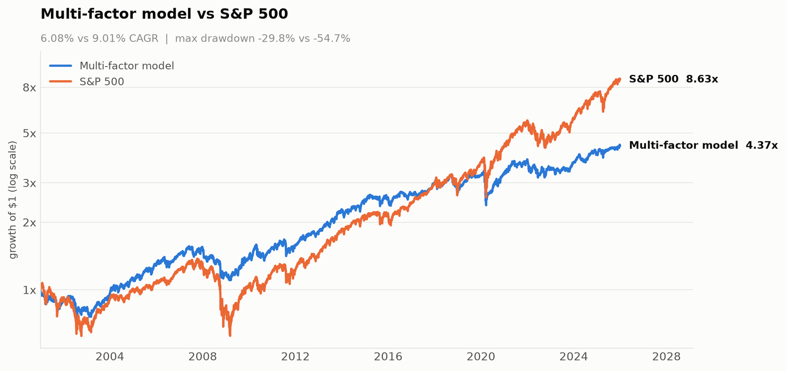
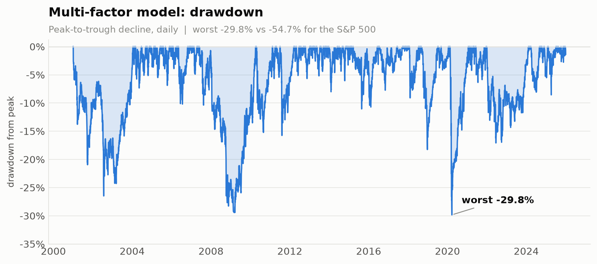
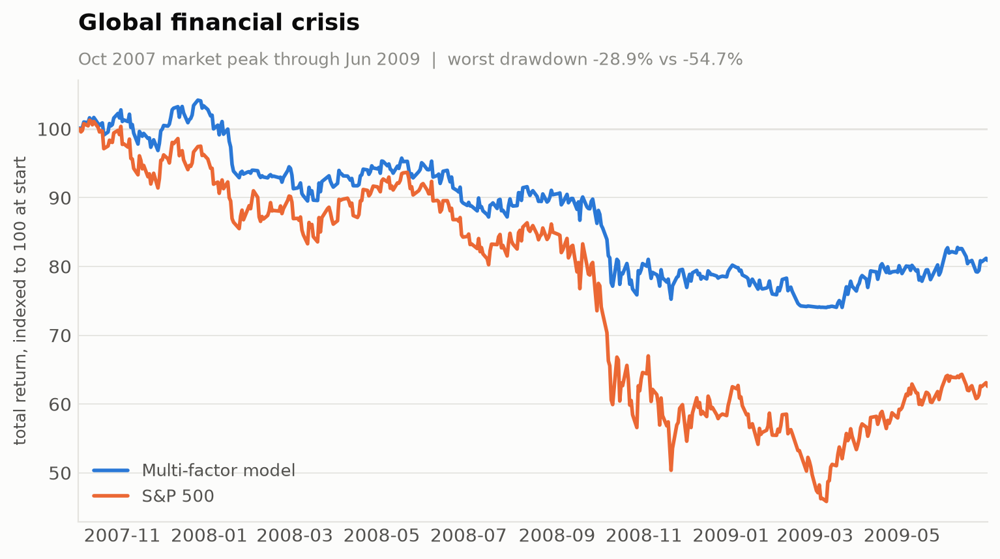
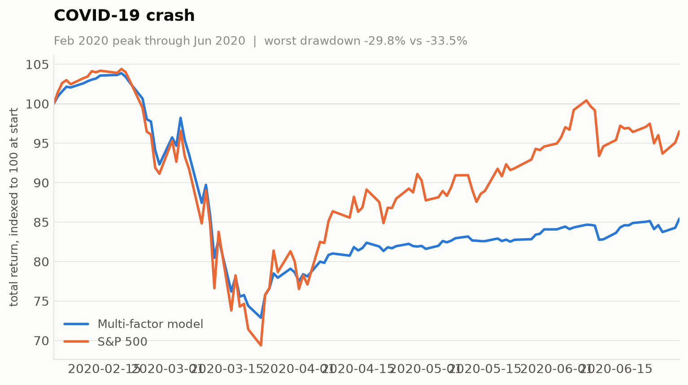
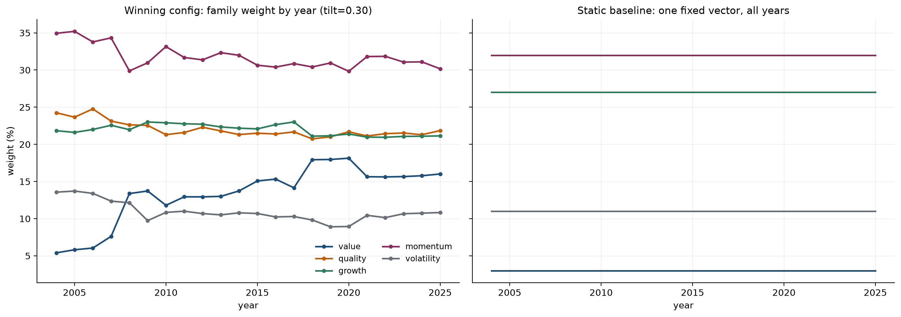

# S&P 500 Multi-Factor Equity Model

A long-only equity strategy over the S&P 500, 2001–2025. 48 fundamental, momentum and
volatility factors are ranked sector-neutrally, blended by their trailing Information Coefficient
, and traded as a 25-stock portfolio with two independent de-risking overlays.

## Results

2001–2025, net of 7.5bps per trade, 3% risk-free rate.

| | CAGR | Volatility | Sharpe | Sortino | Calmar | Max drawdown |
|---|---|---|---|---|---|---|
| **Multi-factor model** | 6.09% | 13.0% | 0.293 | 0.398 | **0.204** | **−29.8%** | 
| S&P 500 (total return) | 9.01% | 19.2% | 0.393 | 0.551 | 0.165 | −54.7% | 

The model beats the index on drawdown-adjusted return (Calmar 0.204 vs 0.165) and takes
roughly half the peak-to-trough loss, but trails on absolute return and on Sharpe. It has a
lower-return, materially lower-risk profile.

The backtest credits dividends to cash as they are paid, so the model's curve is a total-return
series.




### Crisis behaviour

| Window | Model | S&P 500 | Model DD | S&P 500 DD |
|---|---|---|---|---|
| GFC (Oct 2007 – Jun 2009) | −19.1% | −37.4% | −28.9% | −54.7% |
| COVID (Feb – Jun 2020) | −14.6% | −3.5% | −29.8% | −33.5% |

These two crises show the overlays' trade-off in opposite directions. Through the GFC's slow
grind the de-risking worked as intended, cutting the loss roughly in half. In COVID it cut
exposure into the trough and then missed the V-shaped recovery, so the model ended the
window well behind an index that had almost fully recovered. Reactive de-risking pays for
protection in crashes with underperformance in sharp rebounds.




### Limitations

The factor set shows little reliable cross-sectional edge in S&P 500 large caps over this
period. Four independent signs point the same way: a parameter-free Rank-IC rule beat a
150-trial tuned GBM (Sharpe 0.293 vs 0.062); several value factors carry negative mean IC;
the hand-weighted composite's IC was −0.0019 with an inverted decile spread; and performance
swings non-monotonically with the IC lookback (Sharpe 0.263 / 0.104 / 0.168 at 12 / 24 / 36
months).

The 12-month lookback was selected as the best cell of that sweep, and the overlay was tuned
on the full sample with no holdout, so **the reported edge carries selection bias and should
be expected to shrink out of sample.** The risk-management result is the robust part.

## Prerequisites

```bash
pip install -r requirements.txt
```

Requires CRSP daily stock files, Compustat fundamentals, the CCM link table and GICS history
as Parquet in `data/raw/` (WRDS subscription). Panels are built once and cached to
`data/cache/`; nothing on the critical path re-downloads.

## Components

### Settings (`src/settings.py`)
Every tunable in one file: factor lists, disabled factors, lookback windows, book size and
per-name cap, rebalance clock, drawdown tiers, vol target, cost, and search budgets.

### Universe (`src/universe.py`)
- `get_membership_history()` — index membership with add/drop dates
- `get_point_in_time_universe(as_of_date)` — constituents on a given date
- `get_historical_tickers(start, end)` — every name that was ever a member in a window

GICS sectors come from WRDS history joined into the panels, not from any external lookup.

### Factor model (`src/factors.py`)
48 live factors across five families — value (8), quality (14), growth (12), momentum (10),
volatility (4).

- `sector_neutral_percentile()` — rank within (date, sector); sign flips "lower is better"
- `rolling_rank_ic()` — trailing Spearman IC of each factor vs forward return
- `ic_weight_schedule()` — turns those ICs into per-rebalance weights
- `compute_combined_score()` — full daily pipeline to a single `combined_score`
- `market_proxy_return()` — cap-weighted benchmark, weighted by **prior-day** market cap

Weights are not fitted. Each factor's weight is its own trailing 12-month IC, floored at
zero, so a factor that stops predicting drops out of its family's blend. Family weights are
bounded to [5%, 60%], so no family can dominate the blend or be switched off entirely.



### Cross-sectional model (`src/cross_sectional.py`)
A GBM alternative to the composite: one model over every (stock, month-end) pair (~148k rows,
48 features), label demeaned within date so it learns relative ranking rather than market
direction. Walk-forward folds with a one-month embargo, since the 21-day label would
otherwise overlap the test window.

Included for comparison and **not used in the headline result** — it underperformed the
parameter-free Rank-IC rule (Sharpe 0.062 vs 0.293).

### Selection & sizing (`src/sizing.py`)
- `StockPicker` — top 25 on a 25-day clock, interrupted early if a holding falls past rank 75
  or a non-holding enters the top 10 (both 3-day confirmed)
- `compute_weights()` / `apply_weight_cap()` — inverse-vol weights, 5% per-name cap
- `VolatilityTargetOverlay` — scales exposure by 15% / trailing realized vol, capped at 1.0
- `DrawdownOverlay` — three tiers cutting exposure at −5.1% / −10.4% / −28.4%, with
  volatility-based re-entry

Both overlays only ever de-risk. Weights sum to 1.0 and neither multiplier exceeds 1.0, so
gross exposure is ≤ 100% by construction — the book is never levered.

### Backtesting (`src/backtest/`)
Event-driven engine with one-bar execution latency and a flat 7.5bps cost model.
`TCAReporter` produces Sharpe, Sortino, Calmar, volatility, max drawdown and turnover.

### Optimizer (`src/optimize.py`)
Optuna search over the 9 risk-engine parameters — no-trade band, vol window, drawdown
re-entry ratio, and three tier thresholds plus three multipliers. Stock selection is never
optimized; the signal is fully determined by the Rank-IC rule.

The objective is `−mean(fold Sharpe) + mean(fold |max drawdown|)`. Sharpe alone is blind to
drawdown depth, which is why an unpenalized search never used the deep end of the tiers:
going flat during a crash forfeits the recovery leg, and Sharpe rewards riding it out.

### Plots (`src/plots.py`)
Regenerates every figure in `results/performance/` from a completed backtest.

## Repository structure

```
data/
  raw/                     CRSP, Compustat, GICS, membership (not committed)
  cache/                   built panels + run summaries (not committed)
results/
  factor_weights/          factor and family weight evolution
  performance/             equity curve, drawdown, crisis windows
  optimization/            best-parameter exports
src/
  settings.py              all configuration
  universe.py              index membership and sectors
  factors.py               factor construction, Rank-IC weighting, combiner
  cross_sectional.py       GBM alternative to the composite
  sizing.py                selection, position sizing, de-risking overlays
  backtest/                event-driven engine and performance reporting
  optimize.py              Optuna search over the risk engine
  plots.py                 figure generation
tests/
  test_no_lookahead.py     mechanical look-ahead checks
notebooks/
  backtest.ipynb           end-to-end walkthrough
```

## Pipeline flow

```
CRSP + Compustat + GICS
  -> universe.py            survivorship-bias-free membership
  -> factors.py             48 factors -> sector-neutral percentiles
                            trailing Rank IC -> per-rebalance weights
                            -> combined_score
  -> sizing.py              top 25, inverse-vol, 5% cap
                            -> vol target -> drawdown tiers
  -> backtest/              event-driven fills, 7.5bps
  -> optimize.py            Optuna over the 9 risk parameters
  -> results/
```

## Configuration

Common edits in `src/settings.py`:

| Setting | Default | Effect |
|---|---|---|
| `SELECTION_N` | 25 | Book size |
| `MAX_WEIGHT_MULTIPLE_OF_EQUAL` | 1.25 | Per-name cap (5% at N=25) |
| `RANK_IC_WINDOW_MONTHS` | 12 | Trailing window for factor weights |
| `FAMILY_WEIGHT_BOUNDS` | (0.05, 0.60) | Min/max share per family |
| `REBALANCE_INTERVAL_DAYS` | 25 | Scheduled rebalance clock |
| `TARGET_VOL` | 0.15 | Annualized volatility target |
| `DRAWDOWN_TIERS` | 3 tiers | Thresholds and exposure multipliers |
| `FLAT_COST_BPS` | 7.5 | Round-trip cost assumption |
| `DISABLED_FACTORS` | 5 factors | Excluded from every blend |

## Tests

```bash
pytest tests/
```

